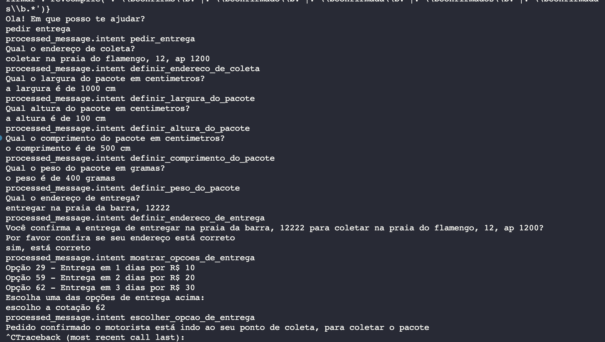
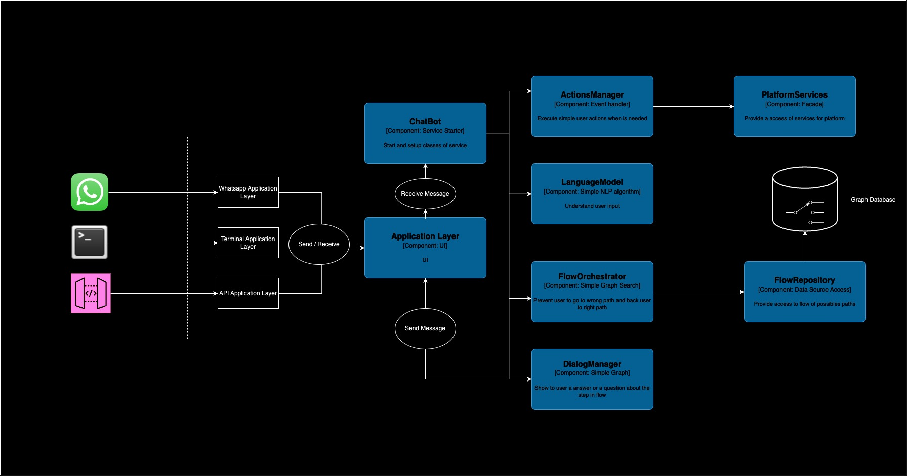

<h1>PUCPR - Agentes conversacionais - Chat bot com python:</h1>

<h3>Objetivo:</h3>
    Este agente conversacional fechado, auxilia o cliente a pedir uma entrega de um pacote online usando um dos projetos que participo:
    https://any.stone.com.br

<h4> Em funcionamento </h4>
    
    OBS: existe um arquivo chamado test.txt onde há um dialogo de testes

<h3>Para rodar:</h3>
```sh
    python3 -m venv venv &&
    . ./venv/bin/activate &&
    pip install -r requirements.txt
```

<h3>Arquitetura:</h3>
    

<h3>Componentes importantes e suas reponsabilidades:</h3>
    <ul>
        <li>
            TerminalApplicationLayer: Responsável por fazer interface com o terminal para rodar a aplicação quando está no model terminal
        </li>
        <li>
            WhatsappApplicationLayer: Responsável por fazer interface com o terminal para rodar a aplicação quando está no model whatsapp
        </li>
        <li>
            ChatBot: Classe responsável pelo start e injeção de dependencia em toda a aplicação
        </li>
        <li>
            LanguageUnderstandingModel: Modelo de NLP básico criado na nltk
        </li>
        <li>
            ActionsManager: Gerenciador de ações do usuário na plataforma
        </li>
        <li>
            DialogManager: Controlador de devoluções de dialogos
        </li>
        <li>
            FlowOrchestrator: Controlador do fluxo para garantir que o usuário sempre que cair no fluxo de exceção vai voltar ao normal
        </li>
    </ul>

<h3>Técnicas utilizadas</h3>
    - Named Entity Recognition (NER)
    - Patternmatching
    - Intents

<h3>Observações</h3>
    1 - Optei por fazer algumas na mão sem utilizar plataformas prontas, justamente para aprender mais sobre o tema.
    2 - O modelo N.E.R. se encontra no ActionsManager para interpretação de medidas
    3 - No LanguageUnderstandingModel se encontra as configurações dos modelo
